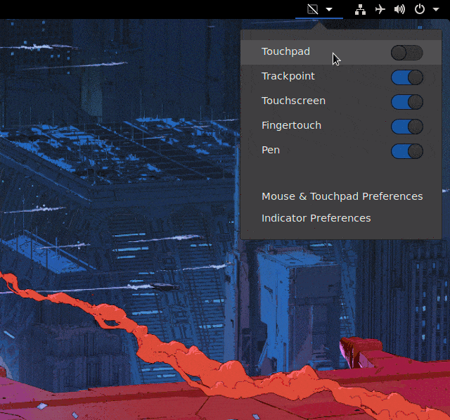

# TouchpadIndicator
Touchpad management GNOME Shell Extension.

Automatically disable other pointing devices when an external mouse is plugged in.  
Optionally, switch the touchpad, trackpoint, fingertouch, touchscreen or a pen device on and off easily from the top panel.




## Installation

**From GNOME Shell Extension Website** (recommended)
 1. Visit [https://extensions.gnome.org/extension/131/touchpad-indicator/](https://extensions.gnome.org/extension/131/touchpad-indicator/) in Firefox browser.
 2. Click on the switch at right side to toggle it from OFF to ON.
 3. Accept any installation prompts.

**From GitHub**
 1. Open a terminal and run:
    ```bash
    rm -rf ~/.local/share/gnome-shell/extensions/touchpad-indicator@orangeshirt;
    git clone --depth=1 "https://github.com/askmrsinh/touchpad-indicator.git" ~/.local/share/gnome-shell/extensions/touchpad-indicator@orangeshirt;
    ```
 2. Restart GNOME Shell by pressing `Alt+F2`, `r`, `Enter` or by Logging out and Logging in.
 3. Enable the extension in *[gnome-tweak-tool](https://wiki.gnome.org/action/show/Apps/Tweaks)*.


## License

Touchpad Indicator GNOME Shell Extension is distributed under the terms of the **[GNU General Public License, version 2 (GPL-2.0)](http://www.gnu.org/licenses/old-licenses/gpl-2.0.en.html)**.
